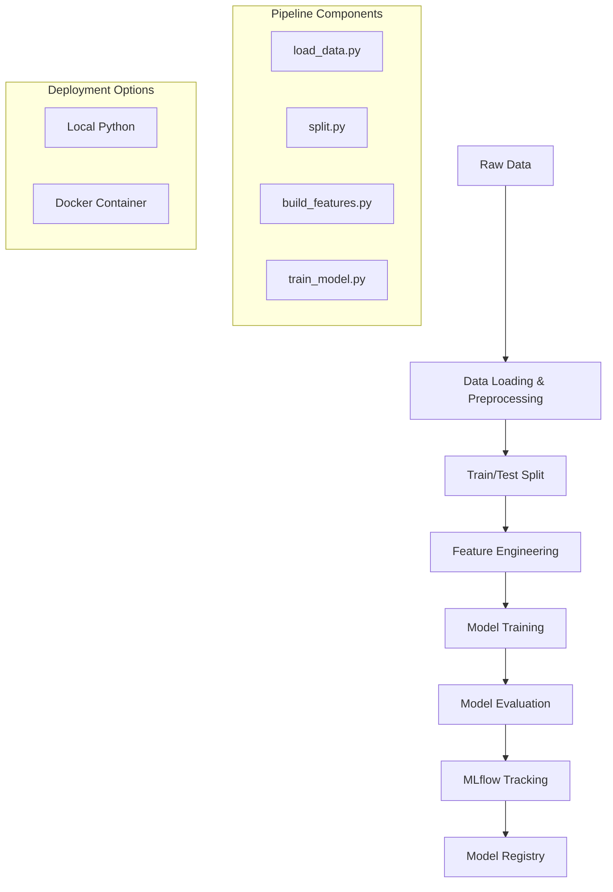

# 🚀 Employee Attrition Prediction MLOps Pipeline

<div align="center">


*An end-to-end machine learning pipeline for predicting employee attrition with automated MLOps workflows*

[Quick Start](#-quick-start) • [Features](#-features) • [Architecture](#-architecture) • [Documentation](#-documentation)

</div>

---

## 🎯 Overview

This project implements a **production-ready MLOps pipeline** for predicting employee attrition using machine learning. Built with industry best practices, it provides automated data processing, model training, evaluation, and experiment tracking through **MLflow**. The pipeline supports both local development and containerized deployment for scalable production environments.

### 🔥 Key Highlights
- **Automated end-to-end workflow** from raw data to trained models
- **MLflow integration** for comprehensive experiment tracking
- **Docker containerization** for consistent deployment
- **Multiple ML algorithms** with automated hyperparameter tuning
- **Production-ready code structure** following MLOps best practices

---

## ✨ Features

| Feature | Description |
|---------|-------------|
| 🔄 **Data Pipeline** | Automated data loading, cleaning, and preprocessing |
| 🔀 **Smart Splitting** | Stratified train/test splits with configurable ratios |
| 🧪 **Feature Engineering** | Automated scaling, encoding, and feature transformation |
| 🤖 **Multi-Model Training** | Logistic Regression, Random Forest with cross-validation |
| 📊 **Experiment Tracking** | Complete MLflow integration with metrics and artifacts |
| 🐳 **Containerized Deployment** | Docker and Docker Compose support |
| 🎯 **Model Evaluation** | Comprehensive metrics, ROC curves, and confusion matrices |
| 📈 **Visualization** | Automated plots and performance dashboards |

---

## 🏗️ Architecture



---

## 📁 Project Structure

```
employee-attrition-ml/
├── 📂 data/
│   ├── raw/                    # Raw input data
│   └── processed/              # Processed datasets
├── 📂 models/                  # Trained models & preprocessors
├── 📂 mlruns/                  # MLflow experiment data
├── 📂 scripts/
│   └── run_training.sh         # Bash execution script
├── 📂 src/
│   ├── data/
│   │   ├── load_data.py        # Data loading & preprocessing
│   │   └── split.py            # Dataset splitting logic
│   ├── features/
│   │   └── build_features.py   # Feature engineering pipeline
│   ├── models/
│   │   └── train_model.py      # Model training & evaluation
│   └── __init__.py
├── 🐳 Dockerfile              # Container configuration
├── 🐳 docker-compose.yml      # Multi-service orchestration
├── 📋 requirements.txt        # Python dependencies
├── 🐍 run_pipeline.py         # Local orchestrator
└── 📖 README.md               # This file
```

---

## 🚀 Quick Start

### Prerequisites

Before you begin, ensure you have the following installed:

- **Git** (latest version)
- **Docker & Docker Compose** (v20.10+)
- **Python 3.8+**
- **pip** package manager

### 1️⃣ Clone & Setup

```bash
# Clone the repository
git clone https://github.com/yourusername/employee-attrition-ml.git
cd employee-attrition-ml

# Create data directory structure
mkdir -p data/raw data/processed models mlruns
```

### 2️⃣ Prepare Your Data

Place your `employee_attrition.csv` file in the `data/raw/` directory:

```bash
cp /path/to/your/employee_attrition.csv data/raw/
```

### 3️⃣ Choose Your Execution Method

#### 🐳 Option A: Docker (Recommended for Production)

```bash
# Build and run the complete pipeline
docker-compose build
docker-compose up run-pipeline

# Access MLflow UI
docker-compose up mlflow-ui
# Visit: http://localhost:5001
```

#### 🐍 Option B: Local Python Environment

```bash
# Create virtual environment
python -m venv venv
source venv/bin/activate  # Windows: venv\Scripts\activate

# Install dependencies
pip install -r requirements.txt

# Run pipeline
python run_pipeline.py

# Launch MLflow UI
mlflow ui
# Visit: http://localhost:5000
```

---

## 🔧 Configuration

### Environment Variables

Create a `.env` file to customize pipeline behavior:

```env
# Data Configuration
RAW_DATA_PATH=data/raw/employee_attrition.csv
PROCESSED_DATA_PATH=data/processed/
MODEL_OUTPUT_PATH=models/

# Model Parameters
TEST_SIZE=0.2
RANDOM_STATE=42
CV_FOLDS=5

# MLflow Configuration
MLFLOW_TRACKING_URI=http://localhost:5000
EXPERIMENT_NAME=employee_attrition_prediction
```

### Pipeline Parameters

Modify `config.py` to adjust model parameters:

```python
MODEL_CONFIGS = {
    'logistic_regression': {
        'C': [0.1, 1.0, 10.0],
        'max_iter': 1000
    },
    'random_forest': {
        'n_estimators': [100, 200, 300],
        'max_depth': [10, 20, None]
    }
}
```

---

## 📊 Pipeline Workflow

### Step 1: Data Loading & Preprocessing
- **Input**: `data/raw/employee_attrition.csv`
- **Process**: Handle missing values, data type conversion, initial cleaning
- **Output**: `data/processed/processed_employee_attrition.csv`

### Step 2: Data Splitting
- **Process**: Stratified split maintaining class distribution
- **Output**: `train.csv`, `test.csv`

### Step 3: Feature Engineering
- **Process**: Scaling numerical features, encoding categorical variables
- **Output**: `X_train_processed.csv`, `X_test_processed.csv`, `y_train.csv`, `y_test.csv`
- **Artifacts**: `preprocessor.joblib`

### Step 4: Model Training & Evaluation
- **Process**: Train multiple models with cross-validation
- **Output**: `model.joblib`
- **MLflow Logging**: Parameters, metrics, model artifacts, visualizations

---

## 📈 Model Performance Tracking

The pipeline automatically tracks comprehensive metrics through MLflow:

### 🎯 Classification Metrics
- **Accuracy**
- **Precision, Recall, F1-Score**
- **ROC-AUC Score**
- **Confusion Matrix**

### 📊 Visualizations
- **ROC Curves**
- **Precision-Recall Curves**
- **Feature Importance Plots**
- **Confusion Matrix Heatmaps**

### 🔍 Experiment Comparison
Access the MLflow UI to compare different runs, models, and hyperparameters:

```bash
mlflow ui --host 0.0.0.0 --port 5000
```

---

## 🚀 Production Deployment

### Docker Production Setup

```yaml
# docker-compose.prod.yml
version: '3.8'
services:
  ml-pipeline:
    build: .
    environment:
      - MLFLOW_TRACKING_URI=http://mlflow:5000
    volumes:
      - ./data:/app/data
      - ./models:/app/models
    depends_on:
      - mlflow
      
  mlflow:
    image: python:3.9-slim
    command: mlflow server --host 0.0.0.0 --port 5000
    ports:
      - "5000:5000"
    volumes:
      - ./mlruns:/mlruns
```

### Kubernetes Deployment

```yaml
# k8s-deployment.yaml
apiVersion: apps/v1
kind: Deployment
metadata:
  name: employee-attrition-ml
spec:
  replicas: 3
  selector:
    matchLabels:
      app: employee-attrition-ml
  template:
    metadata:
      labels:
        app: employee-attrition-ml
    spec:
      containers:
      - name: ml-pipeline
        image: your-registry/employee-attrition-ml:latest
        ports:
        - containerPort: 8000
```

---

## 🧪 Testing

Run the test suite to ensure pipeline integrity:

```bash
# Unit tests
python -m pytest tests/unit/

# Integration tests
python -m pytest tests/integration/

# Pipeline validation
python scripts/validate_pipeline.py
```

---

## 🐞 Troubleshooting

### Common Issues & Solutions

| Issue | Solution |
|-------|----------|
| **FileNotFoundError: employee_attrition.csv** | Ensure the file is in `data/raw/` directory |
| **Docker volume permissions (Linux)** | Run `sudo chown -R $(id -u):$(id -g) data models mlruns` |
| **Port conflicts (5000/5001)** | Update ports in `docker-compose.yml` or use `mlflow ui --port 5050` |
| **Module import errors** | Ensure you're running from project root with activated environment |
| **Out of memory errors** | Reduce batch size or dataset size for testing |

### Debug Mode

Enable verbose logging:

```bash
export LOG_LEVEL=DEBUG
python run_pipeline.py
```

---

## 📚 Documentation

### API Documentation
- [Pipeline API Reference](docs/api.md)
- [Model Configuration Guide](docs/configuration.md)
- [Deployment Guide](docs/deployment.md)

### Tutorials
- [Getting Started Tutorial](docs/tutorials/getting-started.md)
- [Advanced Configuration](docs/tutorials/advanced-config.md)
- [Custom Feature Engineering](docs/tutorials/custom-features.md)

---

## 🤝 Contributing

We welcome contributions! Please follow these steps:

1. **Fork** the repository
2. **Create** a feature branch (`git checkout -b feature/amazing-feature`)
3. **Commit** your changes (`git commit -m 'Add amazing feature'`)
4. **Push** to the branch (`git push origin feature/amazing-feature`)
5. **Open** a Pull Request

### Development Setup

```bash
# Install development dependencies
pip install -r requirements-dev.txt

# Install pre-commit hooks
pre-commit install

# Run code formatting
black src/
isort src/

# Run linting
flake8 src/
```

---

---

## 🙏 Acknowledgments

- **MLflow** team for the excellent experiment tracking platform
- **scikit-learn** contributors for the robust ML library
- **Docker** for containerization capabilities
- The open-source community for continuous inspiration

---

## 📞 Support

- 🐛 **Bug Reports**: [Create an issue](https://github.com/yourusername/employee-attrition-ml/issues)
- 💡 **Feature Requests**: [Start a discussion](https://github.com/yourusername/employee-attrition-ml/discussions)
- 📧 **Email**: behrooz.filzadeh@gmail.com.com

---

<div align="center">

**⭐ Star this repository if it helped you!**

Made with ❤️ by behrooz filzadeh (https://github.com/behrooz filzadeh)

</div>
